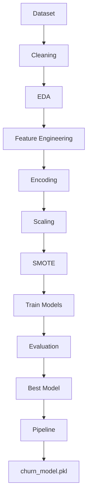

# 📞 Customer Churn Prediction using Supervised Machine Learning

#  🎥 Explaination Video

``` text
https://drive.google.com/file/d/13lokzYrFzxSdSYcL6uv5epl1RdddnqMS/view?usp=sharing
```

> **A complete end-to-end Machine Learning project for predicting
> telecom customer churn using multiple supervised learning
> algorithms.**


------------------------------------------------------------------------

# 📑 Table of Contents

-   Project Overview
-   Business Problem
-   Dataset
-   Features
-   Project Workflow
-   Exploratory Data Analysis
-   Data Preprocessing
-   Machine Learning Models
-   Model Evaluation
-   Folder Structure
-   Installation
-   Screenshots
-   Demo Video
-   Useful Links
-   Future Improvements
-   Author

------------------------------------------------------------------------

# 🚀 Project Overview

Customer churn prediction helps telecom companies identify customers who
are likely to leave their service. By predicting churn early, businesses
can reduce revenue loss through proactive retention campaigns.

This project compares four supervised learning algorithms:

-   K-Nearest Neighbors (KNN)
-   Gaussian Naive Bayes
-   Support Vector Machine (SVM)
-   Decision Tree

The project includes complete preprocessing, feature engineering, SMOTE
balancing, hyperparameter tuning, evaluation, and deployment using a
saved `joblib` pipeline.

------------------------------------------------------------------------

# 💼 Business Problem

Acquiring a new customer is significantly more expensive than retaining
an existing one. The objective is to predict potential churners so the
retention team can contact them before they leave.

------------------------------------------------------------------------

# 📂 Dataset

**IBM Telco Customer Churn Dataset**

-   7,043 Customers
-   21 Features
-   Binary Target: **Churn (Yes / No)**

Dataset: https://www.kaggle.com/datasets/blastchar/telco-customer-churn

------------------------------------------------------------------------

# 📋 Features

  Category       Examples
  -------------- --------------------------------
  Demographics   Gender, SeniorCitizen, Partner
  Services       InternetService, PhoneService
  Billing        MonthlyCharges, TotalCharges
  Contract       Contract Type, Payment Method
  Target         Churn

------------------------------------------------------------------------

# 🔄 Project Workflow



------------------------------------------------------------------------

# 📊 Exploratory Data Analysis

Performed:

-   Class distribution
-   Histograms
-   Count plots
-   Box plots
-   Correlation heatmap
-   Contract-wise churn
-   Tenure analysis
-   Monthly charges analysis

### Key Insights

-   Month-to-month customers churn the most.
-   Customers with low tenure have higher churn.
-   Higher monthly charges correlate with churn.
-   Long-term contracts reduce churn.

------------------------------------------------------------------------

# ⚙ Data Preprocessing

-   Removed CustomerID
-   Converted TotalCharges to numeric
-   Missing value treatment
-   Feature Engineering
-   One-Hot Encoding
-   Label Encoding
-   Standard Scaling
-   Train-Test Split
-   SMOTE

------------------------------------------------------------------------

# 🤖 Models Used

  Model                  Purpose
  ---------------------- -------------------------------
  KNN                    Distance-based classification
  Gaussian Naive Bayes   Probabilistic model
  SVM                    Maximum margin classifier
  Decision Tree          Rule-based classifier

------------------------------------------------------------------------

# 📈 Evaluation Metrics

-   Accuracy
-   Precision
-   Recall
-   F1-Score
-   ROC-AUC
-   Confusion Matrix

**Primary Business Metric:** Recall

------------------------------------------------------------------------

# 🏆 Model Comparison

  Model             Accuracy   Precision   Recall   F1   ROC-AUC
  --------------- ---------- ----------- -------- ---- ---------
  KNN                      ✔           ✔        ✔    ✔         ✔
  Naive Bayes              ✔           ✔        ✔    ✔         ✔
  SVM                      ✔           ✔        ✔    ✔         ✔
  Decision Tree            ✔           ✔        ✔    ✔         ✔

Replace ✔ values with actual notebook metrics.

------------------------------------------------------------------------

# 📁 Project Structure

``` text
telco-churn-supervised-learning/
│
├── CustomerChurn_SupervisedLearning.ipynb
├── churn_model.pkl
├── requirements.txt
├── summary_report.md
├── README.md
├── images/
│   ├── heatmap.png
│   ├── roc_curve.png
│   ├── confusion_matrix.png
│   ├── feature_importance.png
│   └── workflow.png
└── dataset/
```

------------------------------------------------------------------------

# 📸 Screenshots

Add these images inside `images/`:

``` text
images/

├── heatmap.png
├── roc_curve.png
├── confusion_matrix.png
├── feature_importance.png
├── decision_tree.png
└── model_comparison.png
```

Example:


------------------------------------------------------------------------

# ▶ Installation

``` bash
git clone https://github.com/YOUR_USERNAME/telco-churn-supervised-learning.git
cd telco-churn-supervised-learning
pip install -r requirements.txt
jupyter notebook
```

------------------------------------------------------------------------

# 💻 Prediction

``` python
import joblib

model = joblib.load("churn_model.pkl")
prediction = model.predict(sample_data)
print(prediction)
```

------------------------------------------------------------------------


------------------------------------------------------------------------

# 🔗 Useful Links

-   Kaggle Dataset:
    https://www.kaggle.com/datasets/blastchar/telco-customer-churn
-   Scikit-Learn: https://scikit-learn.org/stable/
-   Pandas: https://pandas.pydata.org/docs/
-   NumPy: https://numpy.org/doc/
-   Matplotlib: https://matplotlib.org/stable/
-   imbalanced-learn: https://imbalanced-learn.org/stable/
-   Joblib: https://joblib.readthedocs.io/

------------------------------------------------------------------------

# 🚀 Future Improvements

-   XGBoost
-   LightGBM
-   CatBoost
-   SHAP Explainability
-   Streamlit Web App
-   Flask/FastAPI API
-   Docker
-   AWS Deployment


